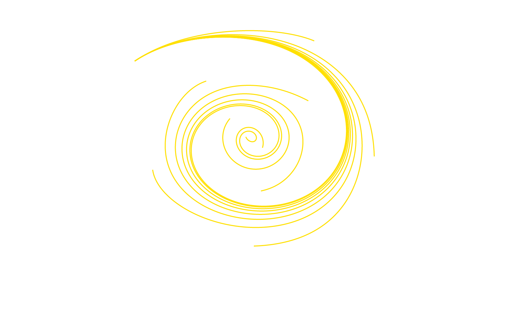

# Project

This is my first JavaScript project where I aimed to create beautiful art using bezier curves. I couldn't find any existing solutions on the web, so I decided to build it myself.

# Idea

The idea behind this project was to explore the artistic possibilities of bezier curves. By manipulating control points and curves, I wanted to create visually appealing and unique art pieces. The program allows users to interactively create, modify, and delete points, resulting in stunning artwork like the image below:

# Instructions

## Deleting Existing Points

To remove a point, simply double-click on it.

## Hiding/Showing Points and Curves

- To hide/show all points, press Shift + H + P.
- For hiding/showing curves, press Shift + H + C.

## Adding Points

1. Select a group by clicking on it.
2. To add a new point, double-click on an empty area of the canvas while the group is selected.

## Moving Points

Click and hold the mouse button on a point, then drag the mouse to relocate the point.

## Toggling Hidden Column

Hold the Ctrl key to toggle the visibility of the hidden column.

*P.S. Note that this feature may have some issues for which we apologize for any inconvenience caused.*

## Group Operations

- Creating a New Group: Click on the [+] button located below the existing groups to create a new group.
- Deleting a Group: To delete a group, click on the [-] button positioned on the right side of the group block.
- Selecting All Groups: Press Shift + A to select all groups.
- Deselecting All Groups: Press Shift + A + C to deselect all groups.

## Changing Color

To modify the color of a curve or points within a group:

- Select the desired group.
- Utilize the color button provided in the group block to change the color.
